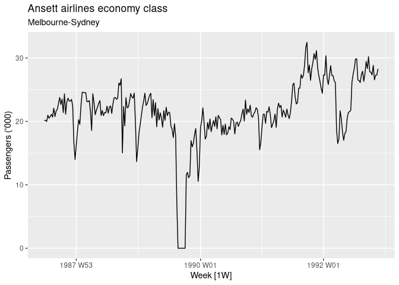
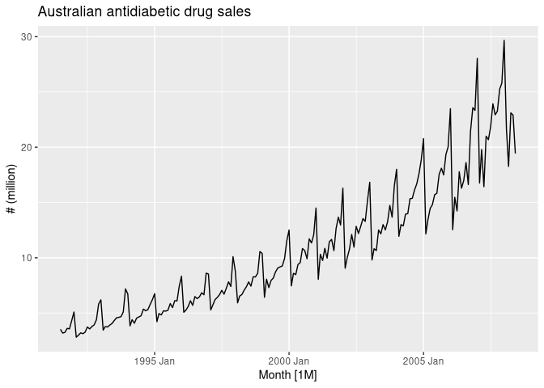
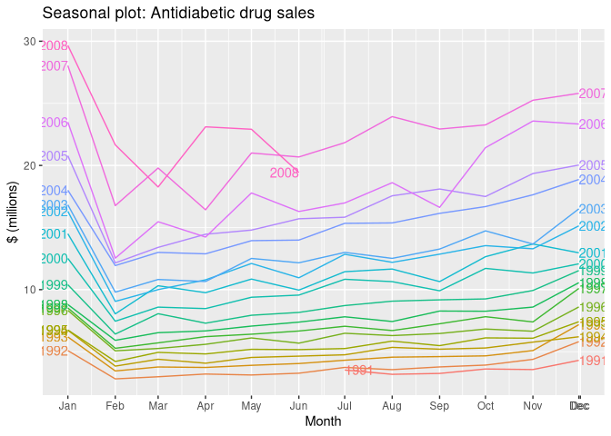

    library(fpp3)

    ## ── Attaching packages ────────────────────────────────────────────── fpp3 0.5 ──

    ## ✔ tibble      3.2.1     ✔ tsibble     1.1.4
    ## ✔ dplyr       1.1.4     ✔ tsibbledata 0.4.1
    ## ✔ tidyr       1.3.1     ✔ feasts      0.3.2
    ## ✔ lubridate   1.9.3     ✔ fable       0.3.4
    ## ✔ ggplot2     3.5.0     ✔ fabletools  0.4.1

    ## ── Conflicts ───────────────────────────────────────────────── fpp3_conflicts ──
    ## ✖ lubridate::date()    masks base::date()
    ## ✖ dplyr::filter()      masks stats::filter()
    ## ✖ tsibble::intersect() masks base::intersect()
    ## ✖ tsibble::interval()  masks lubridate::interval()
    ## ✖ dplyr::lag()         masks stats::lag()
    ## ✖ tsibble::setdiff()   masks base::setdiff()
    ## ✖ tsibble::union()     masks base::union()

# `tsibble` objects

    y <- tsibble(
      Year = 2015:2019,
      Observation = c(123, 39, 78, 52, 110),
      index = Year
    )

    olympic_running

    ## # A tsibble: 312 x 4 [4Y]
    ## # Key:       Length, Sex [14]
    ##     Year Length Sex    Time
    ##    <int>  <int> <chr> <dbl>
    ##  1  1896    100 men    12  
    ##  2  1900    100 men    11  
    ##  3  1904    100 men    11  
    ##  4  1908    100 men    10.8
    ##  5  1912    100 men    10.8
    ##  6  1916    100 men    NA  
    ##  7  1920    100 men    10.8
    ##  8  1924    100 men    10.6
    ##  9  1928    100 men    10.8
    ## 10  1932    100 men    10.3
    ## # ℹ 302 more rows

The 14 time series in this object are uniquely identified by the keys:
the Length and Sex variables. The distinct() function can be used to
show the categories of each variable or even combinations of variables:

    olympic_running |> distinct(Sex)

    ## # A tibble: 2 × 1
    ##   Sex  
    ##   <chr>
    ## 1 men  
    ## 2 women

    PBS

    ## # A tsibble: 67,596 x 9 [1M]
    ## # Key:       Concession, Type, ATC1, ATC2 [336]
    ##       Month Concession   Type      ATC1  ATC1_desc ATC2  ATC2_desc Scripts  Cost
    ##       <mth> <chr>        <chr>     <chr> <chr>     <chr> <chr>       <dbl> <dbl>
    ##  1 1991 Jul Concessional Co-payme… A     Alimenta… A01   STOMATOL…   18228 67877
    ##  2 1991 Aug Concessional Co-payme… A     Alimenta… A01   STOMATOL…   15327 57011
    ##  3 1991 Sep Concessional Co-payme… A     Alimenta… A01   STOMATOL…   14775 55020
    ##  4 1991 Oct Concessional Co-payme… A     Alimenta… A01   STOMATOL…   15380 57222
    ##  5 1991 Nov Concessional Co-payme… A     Alimenta… A01   STOMATOL…   14371 52120
    ##  6 1991 Dec Concessional Co-payme… A     Alimenta… A01   STOMATOL…   15028 54299
    ##  7 1992 Jan Concessional Co-payme… A     Alimenta… A01   STOMATOL…   11040 39753
    ##  8 1992 Feb Concessional Co-payme… A     Alimenta… A01   STOMATOL…   15165 54405
    ##  9 1992 Mar Concessional Co-payme… A     Alimenta… A01   STOMATOL…   16898 61108
    ## 10 1992 Apr Concessional Co-payme… A     Alimenta… A01   STOMATOL…   18141 65356
    ## # ℹ 67,586 more rows

This contains monthly data on Medicare Australia prescription data from
July 1991 to June 2008. These are classified according to various
concession types, and Anatomical Therapeutic Chemical (ATC) indexes. For
this example, we are interested in the Cost time series (total cost of
scripts in Australian dollars).

    PBS |>
      filter(ATC2 == "A10")

    ## # A tsibble: 816 x 9 [1M]
    ## # Key:       Concession, Type, ATC1, ATC2 [4]
    ##       Month Concession   Type     ATC1  ATC1_desc ATC2  ATC2_desc Scripts   Cost
    ##       <mth> <chr>        <chr>    <chr> <chr>     <chr> <chr>       <dbl>  <dbl>
    ##  1 1991 Jul Concessional Co-paym… A     Alimenta… A10   ANTIDIAB…   89733 2.09e6
    ##  2 1991 Aug Concessional Co-paym… A     Alimenta… A10   ANTIDIAB…   77101 1.80e6
    ##  3 1991 Sep Concessional Co-paym… A     Alimenta… A10   ANTIDIAB…   76255 1.78e6
    ##  4 1991 Oct Concessional Co-paym… A     Alimenta… A10   ANTIDIAB…   78681 1.85e6
    ##  5 1991 Nov Concessional Co-paym… A     Alimenta… A10   ANTIDIAB…   70554 1.69e6
    ##  6 1991 Dec Concessional Co-paym… A     Alimenta… A10   ANTIDIAB…   75814 1.84e6
    ##  7 1992 Jan Concessional Co-paym… A     Alimenta… A10   ANTIDIAB…   64186 1.56e6
    ##  8 1992 Feb Concessional Co-paym… A     Alimenta… A10   ANTIDIAB…   75899 1.73e6
    ##  9 1992 Mar Concessional Co-paym… A     Alimenta… A10   ANTIDIAB…   89445 2.05e6
    ## 10 1992 Apr Concessional Co-paym… A     Alimenta… A10   ANTIDIAB…   97315 2.23e6
    ## # ℹ 806 more rows

    PBS |>
      filter(ATC2 == "A10") |>
      select(Month, Concession, Type, Cost)

    ## # A tsibble: 816 x 4 [1M]
    ## # Key:       Concession, Type [4]
    ##       Month Concession   Type           Cost
    ##       <mth> <chr>        <chr>         <dbl>
    ##  1 1991 Jul Concessional Co-payments 2092878
    ##  2 1991 Aug Concessional Co-payments 1795733
    ##  3 1991 Sep Concessional Co-payments 1777231
    ##  4 1991 Oct Concessional Co-payments 1848507
    ##  5 1991 Nov Concessional Co-payments 1686458
    ##  6 1991 Dec Concessional Co-payments 1843079
    ##  7 1992 Jan Concessional Co-payments 1564702
    ##  8 1992 Feb Concessional Co-payments 1732508
    ##  9 1992 Mar Concessional Co-payments 2046102
    ## 10 1992 Apr Concessional Co-payments 2225977
    ## # ℹ 806 more rows

Note that the index variable Month, and the keys Concession and Type,
would be returned even if they were not explicitly selected as they are
required for a tsibble (to ensure each row contains a unique combination
of keys and index).

    PBS |>
      filter(ATC2 == "A10") |>
      select(Month, Concession, Type, Cost) |>
      summarise(TotalC = sum(Cost))

    ## # A tsibble: 204 x 2 [1M]
    ##       Month  TotalC
    ##       <mth>   <dbl>
    ##  1 1991 Jul 3526591
    ##  2 1991 Aug 3180891
    ##  3 1991 Sep 3252221
    ##  4 1991 Oct 3611003
    ##  5 1991 Nov 3565869
    ##  6 1991 Dec 4306371
    ##  7 1992 Jan 5088335
    ##  8 1992 Feb 2814520
    ##  9 1992 Mar 2985811
    ## 10 1992 Apr 3204780
    ## # ℹ 194 more rows

    PBS |>
      filter(ATC2 == "A10") |>
      summarise(TotalC = sum(Cost)) |>
      mutate(Cost = TotalC / 1e6)

    ## # A tsibble: 204 x 3 [1M]
    ##       Month  TotalC  Cost
    ##       <mth>   <dbl> <dbl>
    ##  1 1991 Jul 3526591  3.53
    ##  2 1991 Aug 3180891  3.18
    ##  3 1991 Sep 3252221  3.25
    ##  4 1991 Oct 3611003  3.61
    ##  5 1991 Nov 3565869  3.57
    ##  6 1991 Dec 4306371  4.31
    ##  7 1992 Jan 5088335  5.09
    ##  8 1992 Feb 2814520  2.81
    ##  9 1992 Mar 2985811  2.99
    ## 10 1992 Apr 3204780  3.20
    ## # ℹ 194 more rows

    PBS |>
      filter(ATC2 == "A10") |>
      select(Month, Concession, Type, Cost) |>
      summarise(TotalC = sum(Cost)) |>
      mutate(Cost = TotalC / 1e6) -> a10

## Reading Files

    prison <- readr::read_csv(("https://OTexts.com/fpp3/extrafiles/prison_population.csv"))

    ## Rows: 3072 Columns: 6
    ## ── Column specification ────────────────────────────────────────────────────────
    ## Delimiter: ","
    ## chr  (4): State, Gender, Legal, Indigenous
    ## dbl  (1): Count
    ## date (1): Date
    ## 
    ## ℹ Use `spec()` to retrieve the full column specification for this data.
    ## ℹ Specify the column types or set `show_col_types = FALSE` to quiet this message.

    prison

    ## # A tibble: 3,072 × 6
    ##    Date       State Gender Legal     Indigenous Count
    ##    <date>     <chr> <chr>  <chr>     <chr>      <dbl>
    ##  1 2005-03-01 ACT   Female Remanded  ATSI           0
    ##  2 2005-03-01 ACT   Female Remanded  Non-ATSI       2
    ##  3 2005-03-01 ACT   Female Sentenced ATSI           0
    ##  4 2005-03-01 ACT   Female Sentenced Non-ATSI       5
    ##  5 2005-03-01 ACT   Male   Remanded  ATSI           7
    ##  6 2005-03-01 ACT   Male   Remanded  Non-ATSI      58
    ##  7 2005-03-01 ACT   Male   Sentenced ATSI           5
    ##  8 2005-03-01 ACT   Male   Sentenced Non-ATSI     101
    ##  9 2005-03-01 NSW   Female Remanded  ATSI          51
    ## 10 2005-03-01 NSW   Female Remanded  Non-ATSI     131
    ## # ℹ 3,062 more rows

     prison <- prison |>
      mutate(Quarter = yearquarter(Date)) |>
      select(-Date) |>
      as_tsibble(key=c(State, Gender, Legal, Indigenous),
                 index = Quarter)

    prison

    ## # A tsibble: 3,072 x 6 [1Q]
    ## # Key:       State, Gender, Legal, Indigenous [64]
    ##    State Gender Legal    Indigenous Count Quarter
    ##    <chr> <chr>  <chr>    <chr>      <dbl>   <qtr>
    ##  1 ACT   Female Remanded ATSI           0 2005 Q1
    ##  2 ACT   Female Remanded ATSI           1 2005 Q2
    ##  3 ACT   Female Remanded ATSI           0 2005 Q3
    ##  4 ACT   Female Remanded ATSI           0 2005 Q4
    ##  5 ACT   Female Remanded ATSI           1 2006 Q1
    ##  6 ACT   Female Remanded ATSI           1 2006 Q2
    ##  7 ACT   Female Remanded ATSI           1 2006 Q3
    ##  8 ACT   Female Remanded ATSI           0 2006 Q4
    ##  9 ACT   Female Remanded ATSI           0 2007 Q1
    ## 10 ACT   Female Remanded ATSI           1 2007 Q2
    ## # ℹ 3,062 more rows

This tsibble contains 64 separate time series corresponding to the
combinations of the 8 states, 2 genders, 2 legal statuses and 2
indigenous statuses. Each of these series is 48 observations in length,
from 2005 Q1 to 2016 Q4.

For a tsibble to be valid, it requires a unique index for each
combination of keys. The tsibble() or as\_tsibble() function will return
an error if this is not true.

## 2.2 Time Plots

    melsyd_economy <- ansett |>
      filter(Airports == "MEL-SYD", Class == "Economy") |>
      mutate(Passengers = Passengers/1000)
    autoplot(melsyd_economy, Passengers) +
      labs(title = "Ansett airlines economy class",
           subtitle = "Melbourne-Sydney",
           y = "Passengers ('000)")

    autoplot(a10, Cost) +
      labs(y = "# (million)",
           title = "Australian antidiabetic drug sales")

Here, there is a clear and increasing trend. There is also a strong
seasonal pattern that increases in size as the level of the series
increases. The sudden drop at the start of each year is caused by a
government subsidisation scheme that makes it cost-effective for
patients to stockpile drugs at the end of the calendar year. Any
forecasts of this series would need to capture the seasonal pattern, and
the fact that the trend is changing slowly.

    a10 |>
      gg_season(Cost, labels = 'both') + 
      labs(y = "$ (millions)",
           title = "Seasonal plot: Antidiabetic drug sales")

A seasonal plot allows the underlying seasonal pattern to be seen more
clearly, and is especially useful in identifying years in which the
pattern changes.

## Multiple seasonal periods
