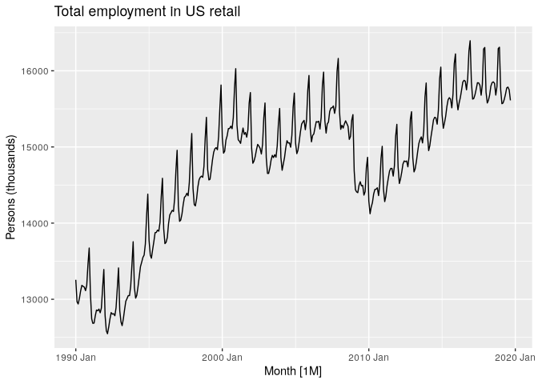
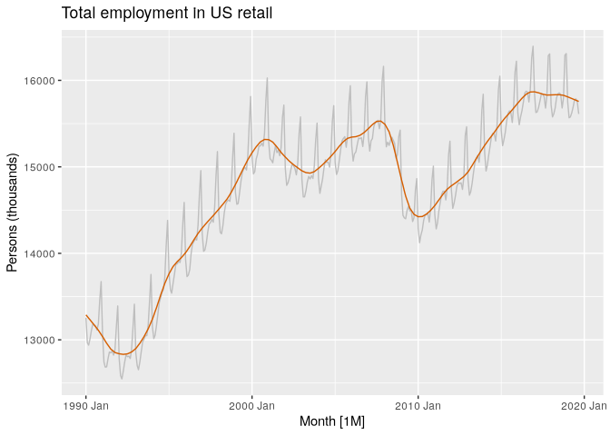
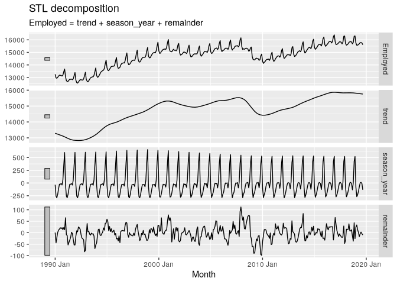
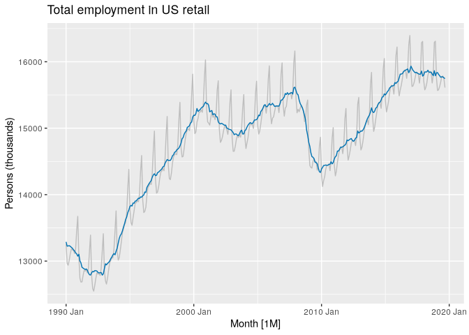

# 3.2 - Time series componenets


``` r
library(fpp3)
```

- *Additive*: $y_{t} = S_{t} + T_{t} + R_t$
- *Multiplicative*: $y_{t} = S_{t} \times T_{t} \times R_t$

To can use a log transformation and then additive to achieve
multiplicative.

## Example: US retail employment

We will decompose the number of persons employed in retail.

``` r
us_retail_employment <- us_employment |>
  filter(year(Month) >= 1990, Title == "Retail Trade") |>
  select(-Series_ID)
autoplot(us_retail_employment, Employed) +
  labs(y = "Persons (thousands)",
       title = "Total employment in US retail")
```



``` r
dcmp <- us_retail_employment |>
  model(stl = STL(Employed))
components(dcmp)
```

    # A dable: 357 x 7 [1M]
    # Key:     .model [1]
    # :        Employed = trend + season_year + remainder
       .model    Month Employed  trend season_year remainder season_adjust
       <chr>     <mth>    <dbl>  <dbl>       <dbl>     <dbl>         <dbl>
     1 stl    1990 Jan   13256. 13288.      -33.0      0.836        13289.
     2 stl    1990 Feb   12966. 13269.     -258.     -44.6          13224.
     3 stl    1990 Mar   12938. 13250.     -290.     -22.1          13228.
     4 stl    1990 Apr   13012. 13231.     -220.       1.05         13232.
     5 stl    1990 May   13108. 13211.     -114.      11.3          13223.
     6 stl    1990 Jun   13183. 13192.      -24.3     15.5          13207.
     7 stl    1990 Jul   13170. 13172.      -23.2     21.6          13193.
     8 stl    1990 Aug   13160. 13151.       -9.52    17.8          13169.
     9 stl    1990 Sep   13113. 13131.      -39.5     22.0          13153.
    10 stl    1990 Oct   13185. 13110.       61.6     13.2          13124.
    # ℹ 347 more rows

``` r
components(dcmp) |>
  as_tsibble() |>
  autoplot(Employed, colour="gray") +
  geom_line(aes(y=trend), color="#D55E00") +
  labs(
    y = "Persons (thousands)",
    title = "Total employment in US retail"
  )
```



``` r
components(dcmp) |> autoplot()
```



## Seasonally adjusted data

``` r
components(dcmp) |>
  as_tsibble() |>
  autoplot(Employed, color='gray') +
  geom_line(aes(y=season_adjust), colour="#0072B2") +
  labs(y = "Persons (thousands)",
       title = "Total employment in US retail")
```



Seasonally adjusted series contain the remainder component as well as
the trend-cycle. Therefore, they are not “smooth”, and “downturns” or
“upturns” can be misleading. If the purpose is to look for turning
points in a series, and interpret any changes in direction, then it is
better to use the trend-cycle component rather than the seasonally
adjusted data.
