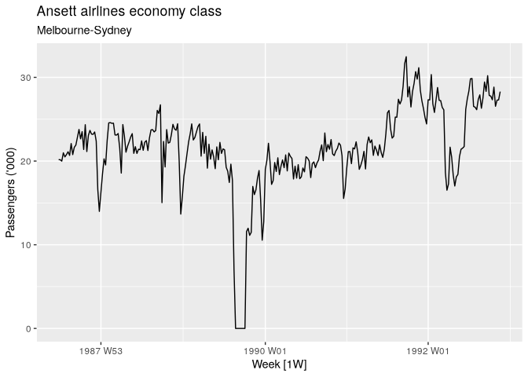
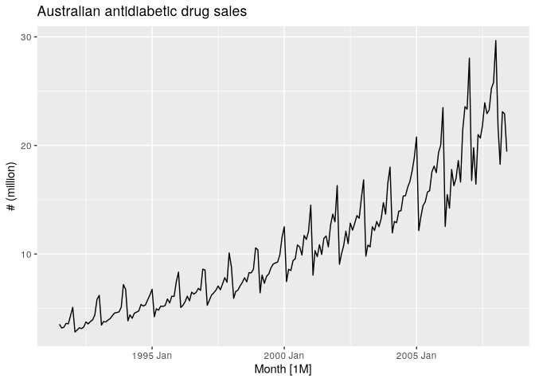

# 02.2 Time Plotst


``` r
library(fpp3)
```

# Time Plots

``` r
melsyd_economy <- ansett |>
  filter(Airports == "MEL-SYD", Class == "Economy") |>
  mutate(Passengers = Passengers/1000)
autoplot(melsyd_economy, Passengers) +
  labs(title = "Ansett airlines economy class",
       subtitle = "Melbourne-Sydney",
       y = "Passengers ('000)")
```



``` r
a10 <- PBS |>
  filter(ATC2 == "A10") |>
  select(Month, Concession, Type, Cost) |>
  summarise(TotalC = sum(Cost)) |>
  mutate(Cost = TotalC / 1e6)
```

``` r
autoplot(a10, Cost) +
  labs(y = "# (million)",
       title = "Australian antidiabetic drug sales")
```



Here, there is a clear and increasing trend. There is also a strong
seasonal pattern that increases in size as the level of the series
increases. The sudden drop at the start of each year is caused by a
government subsidization scheme that makes it cost-effective for
patients to stockpile drugs at the end of the calendar year. Any
forecasts of this series would need to capture the seasonal pattern, and
the fact that the trend is changing slowly.
