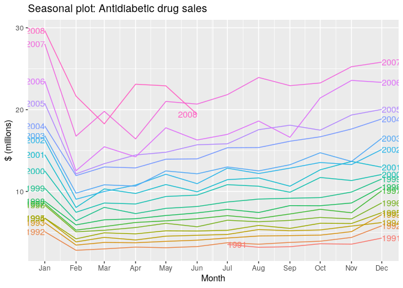
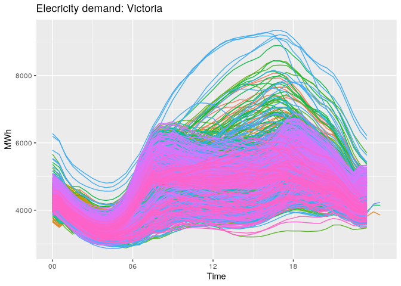
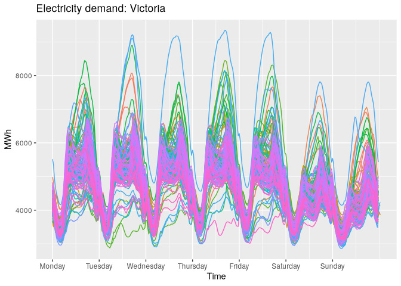
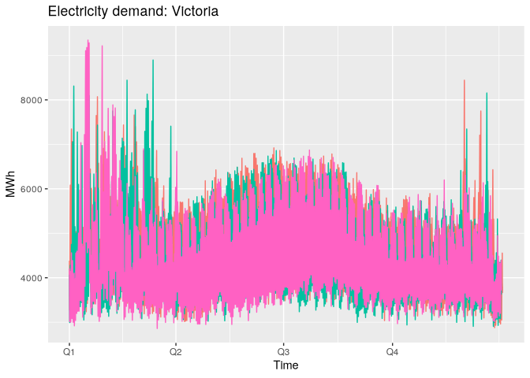
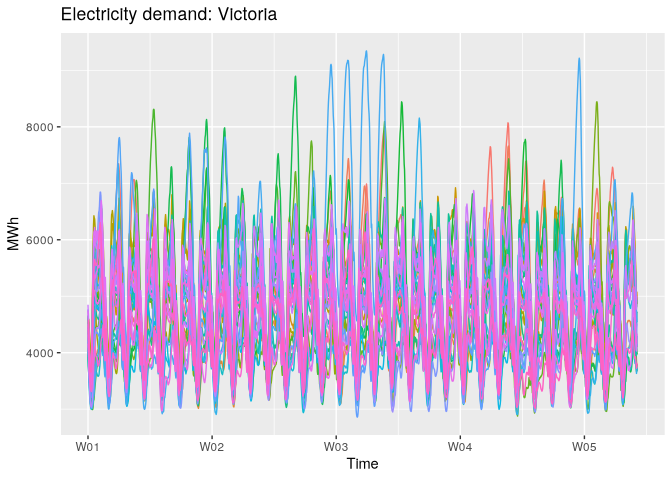

# 02.3 - Seasonal plots


``` r
library(fpp3)
```

``` r
a10 <- PBS |>
  filter(ATC2 == "A10") |>
  select(Month, Concession, Type, Cost) |>
  summarise(TotalC = sum(Cost)) |>
  mutate(Cost = TotalC / 1e6)
a10
```

    # A tsibble: 204 x 3 [1M]
          Month  TotalC  Cost
          <mth>   <dbl> <dbl>
     1 1991 Jul 3526591  3.53
     2 1991 Aug 3180891  3.18
     3 1991 Sep 3252221  3.25
     4 1991 Oct 3611003  3.61
     5 1991 Nov 3565869  3.57
     6 1991 Dec 4306371  4.31
     7 1992 Jan 5088335  5.09
     8 1992 Feb 2814520  2.81
     9 1992 Mar 2985811  2.99
    10 1992 Apr 3204780  3.20
    # ℹ 194 more rows

``` r
a10 |>
  gg_season(Cost, labels = 'both') + 
  labs(y = "$ (millions)",
       title = "Seasonal plot: Antidiabetic drug sales")
```



A seasonal plot allows the underlying seasonal pattern to be seen more
clearly, and is especially useful in identifying years in which the
pattern changes.

## Multiple seasonal periods

Where the data has more than one seasonal pattern, the period argument
can be used to select which seasonal plot is required. The vic_elec data
contains half-hourly electricity demand for the state of Victoria,
Australia. We can plot the daily pattern, weekly pattern or yearly
pattern by specifying the period argument as shown in Figures 2.5–2.7.

In the first plot, the three days with 25 hours are when daylight saving
ended in each year and so these days contained an extra hour. There were
also three days with only 23 hours each (when daylight saving started)
but these are hidden beneath all the other lines on the plot.

``` r
vic_elec |> gg_season(Demand, period = "day") +
  theme(legend.position = "none") +
  labs(y="MWh", title = "Elecricity demand: Victoria")
```



``` r
vic_elec |> gg_season(Demand, period = "week") +
  theme(legend.position = "none") +
  labs(y="MWh", title="Electricity demand: Victoria")
```



``` r
vic_elec |> gg_season(Demand, period = "year") +
  theme(legend.position = "none") +
  labs(y="MWh", title="Electricity demand: Victoria")
```



``` r
vic_elec |> gg_season(Demand, period = "month") +
  theme(legend.position = "none") +
  labs(y="MWh", title="Electricity demand: Victoria")
```


