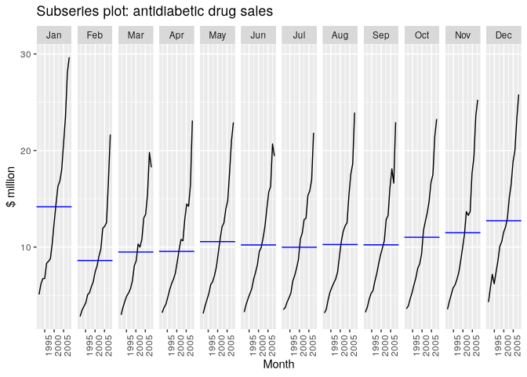
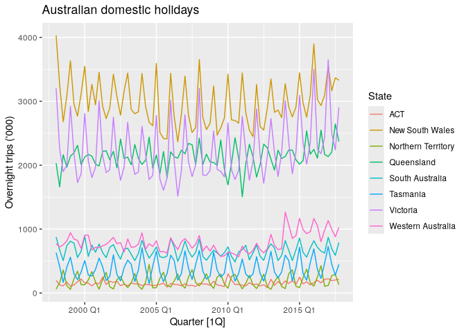
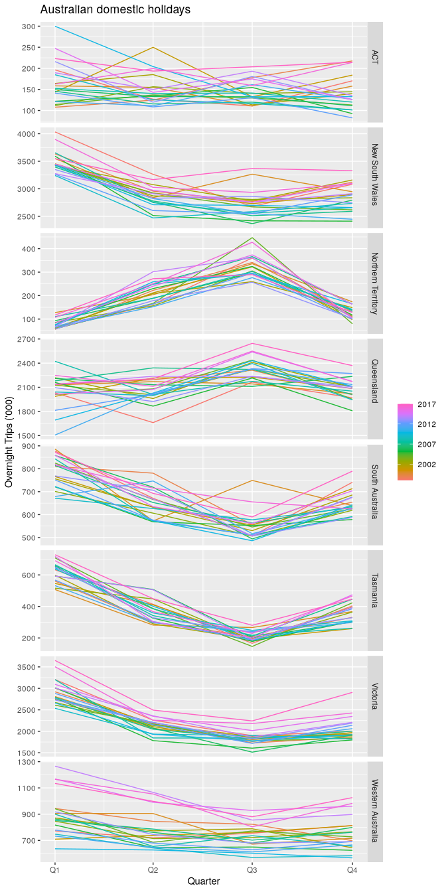
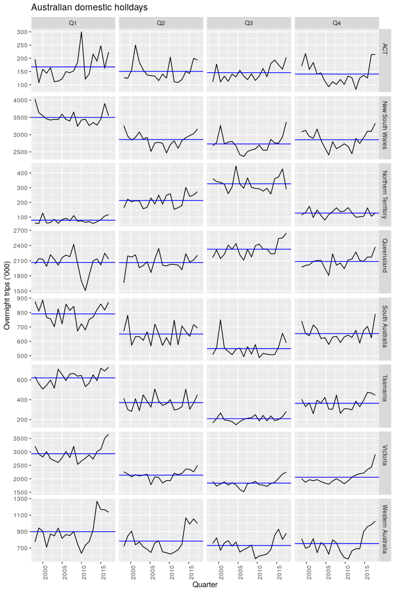

# 02.5 - Seasonal Subseries


``` r
library(fpp3)
```

An alternative plot that emphasises the seasonal patterns is where the
data for each season are collected together in separate mini time plots.

``` r
a10 <- PBS |>
  filter(ATC2 == "A10") |>
  select(Month, Concession, Type, Cost) |>
  summarise(TotalC = sum(Cost)) |>
  mutate(Cost = TotalC / 1e6)
a10
```

    # A tsibble: 204 x 3 [1M]
          Month  TotalC  Cost
          <mth>   <dbl> <dbl>
     1 1991 Jul 3526591  3.53
     2 1991 Aug 3180891  3.18
     3 1991 Sep 3252221  3.25
     4 1991 Oct 3611003  3.61
     5 1991 Nov 3565869  3.57
     6 1991 Dec 4306371  4.31
     7 1992 Jan 5088335  5.09
     8 1992 Feb 2814520  2.81
     9 1992 Mar 2985811  2.99
    10 1992 Apr 3204780  3.20
    # ℹ 194 more rows

``` r
a10 |>
  gg_subseries(Cost) + 
  labs(y="$ million", title = "Subseries plot: antidiabetic drug sales")
```



The blue horizontal lines indicate the means for each month.

## Example: Australian holiday tourism

``` r
holidays <- tourism |>
  filter(Purpose == "Holiday") |>
  group_by(State) |>
  summarise(Trips = sum(Trips))
holidays
```

    # A tsibble: 640 x 3 [1Q]
    # Key:       State [8]
       State Quarter Trips
       <chr>   <qtr> <dbl>
     1 ACT   1998 Q1  196.
     2 ACT   1998 Q2  127.
     3 ACT   1998 Q3  111.
     4 ACT   1998 Q4  170.
     5 ACT   1999 Q1  108.
     6 ACT   1999 Q2  125.
     7 ACT   1999 Q3  178.
     8 ACT   1999 Q4  218.
     9 ACT   2000 Q1  158.
    10 ACT   2000 Q2  155.
    # ℹ 630 more rows

``` r
autoplot(holidays, Trips) +
  labs(y = "Overnight trips ('000)",
       title = "Australian domestic holidays")
```



``` r
gg_season(holidays, Trips) +
  labs(y = "Overnight Trips ('000)",
       title = "Australian domestic holidays")
```



``` r
holidays |>
  gg_subseries(Trips) +
  labs(y = "Overnight trips ('000)",
       title = "Australian domestic holidays")
```


