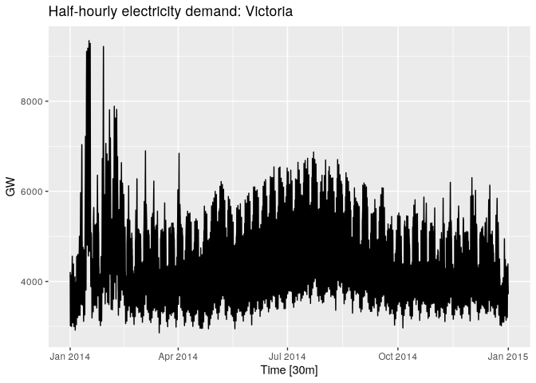
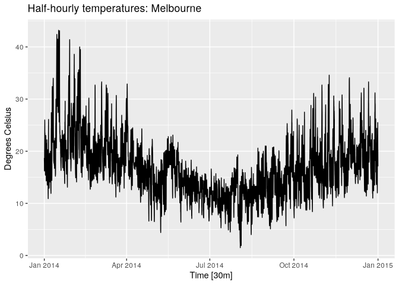
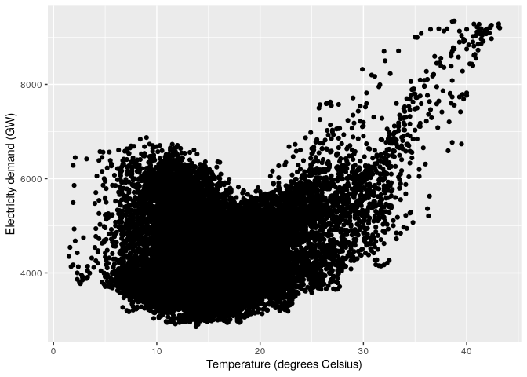
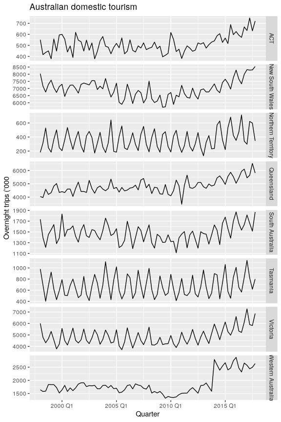
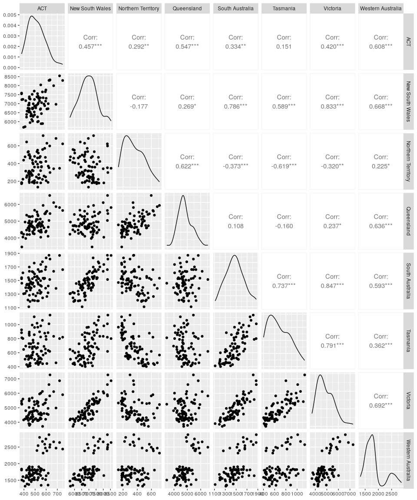

# 02.6 - Scatterplots


``` r
library(fpp3)
```

# Scatterplots

Exploring relationships between time series

Figures [2.12](https://otexts.com/fpp3/scatterplots.html#fig:edemand)
and [2.13](https://otexts.com/fpp3/scatterplots.html#fig:victemp) show
two time series: half-hourly electricity demand (in Gigawatts) and
temperature (in degrees Celsius), for 2014 in Victoria, Australia. The
temperatures are for Melbourne, the largest city in Victoria, while the
demand values are for the entire state.

``` r
vic_elec |>
  filter(year(Time) == 2014) |>
  autoplot(Demand) +
  labs(y = "GW",
       title = "Half-hourly electricity demand: Victoria")
```



``` r
vic_elec |>
  filter(year(Time) == 2014) |>
  autoplot(Temperature) +
  labs(y = "Degrees Celsius",
       title = "Half-hourly temperatures: Melbourne")
```



``` r
vic_elec |>
  filter(year(Time) == 2014) |>
  ggplot(aes(x = Temperature, y = Demand)) +
  geom_point() +
  labs(x = 'Temperature (degrees Celsius)',
       y = "Electricity demand (GW)")
```



The plot shows a clear relationship when temperatures move above 25deg.
Another, smaller effect, at colder temps.

## Correlation

The correlation coefficient only measures the strength of the *linear*
relationship between two variables, and can sometimes be misleading. For
example, the correlation for the electricity demand and temperature data
shown in Figure
[2.14](https://otexts.com/fpp3/scatterplots.html#fig:edemand2) is 0.28,
but the *non-linear* relationship is stronger than that.


Figure 2.16: Each of these plots has a correlation coefficient of 0.82.
Data from Anscombe
([1973](https://otexts.com/fpp3/scatterplots.html#ref-Anscombe1973graphs)).

## Scatterplot matrices

When there are several potential predictor variables, it is useful to
plot each variable against each other variable. Consider the eight time
series shown in Figure
[2.17](https://otexts.com/fpp3/scatterplots.html#fig:vntimeplots),
showing quarterly visitor numbers across states and territories of
Australia

``` r
visitors <- tourism |>
  group_by(State) |>
  summarise(Trips = sum(Trips))
visitors |>
  ggplot(aes(x = Quarter, y = Trips)) +
  geom_line() +
  facet_grid(vars(State), scales = "free_y") +
  labs(title = "Australian domestic tourism",
       y = "Overnight trips ('000")
```



``` r
visitors |>
  pivot_wider(values_from=Trips, names_from = State) |>
  GGally::ggpairs(columns = 2:9)
```



> Figure 2.18: A scatterplot matrix of the quarterly visitor nights in
> the states and territories of Australia.
