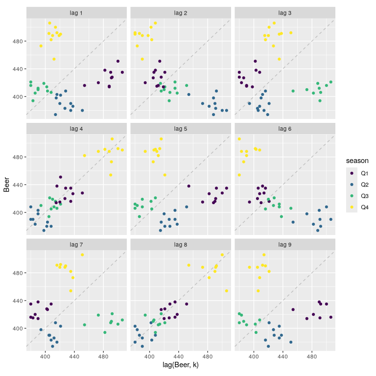

# 02.7 - Lag Plots


``` r
library(fpp3)
```

## Lag Plots

``` r
recent_production <- aus_production |>
  filter(year(Quarter) >= 2000)
```

``` r
recent_production |>
  gg_lag(Beer, geom = "point") +
  labs(x = "lag(Beer, k)")
```


