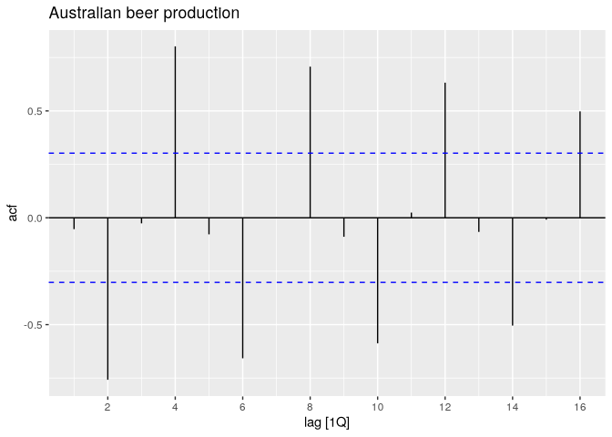
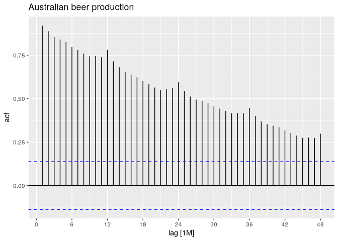

# 02.8 - Autocorrelation


``` r
library(fpp3)
```

``` r
a10 <- PBS |>
  filter(ATC2 == "A10") |>
  select(Month, Concession, Type, Cost) |>
  summarise(TotalC = sum(Cost)) |>
  mutate(Cost = TotalC / 1e6)
```

# Autocorrelation function (ACF)

``` r
recent_production <- aus_production |>
  filter(year(Quarter) >= 2000)
recent_production |> ACF(Beer, lag_max = 9)
```

    # A tsibble: 9 x 2 [1Q]
           lag      acf
      <cf_lag>    <dbl>
    1       1Q -0.0530 
    2       2Q -0.758  
    3       3Q -0.0262 
    4       4Q  0.802  
    5       5Q -0.0775 
    6       6Q -0.657  
    7       7Q  0.00119
    8       8Q  0.707  
    9       9Q -0.0888 

``` r
recent_production |> 
  ACF(Beer) |>
  autoplot() + labs(title = "Australian beer production")
```



## ACF plot showing trend and seasonality

``` r
a10 |>
  ACF(Cost, lag_max = 48) |>
  autoplot() +
  labs(title = "Australian beer production")
```


