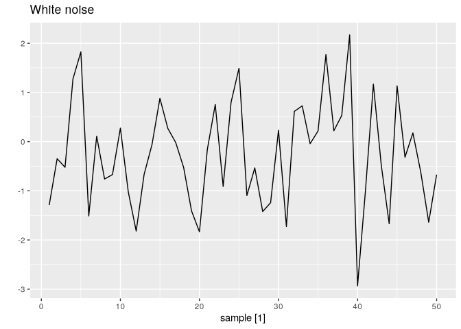
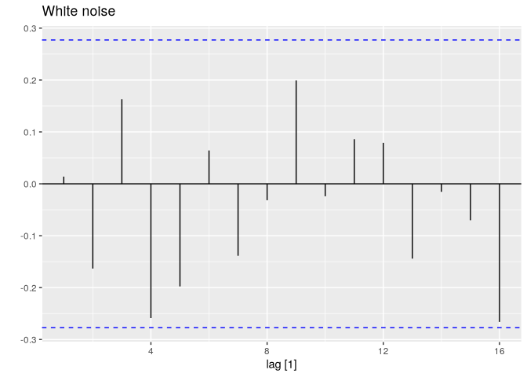

# 02.9 - White Noise


``` r
library(fpp3)
```

``` r
set.seed(30)
y <- tsibble(sample = 1:50, wn = rnorm(50), index = sample)
y |> autoplot(wn) +
  labs(title = "White noise", y = "")
```



``` r
y |> ACF(wn) |>
  autoplot() +
  labs(title = "White noise", y = "")
```


