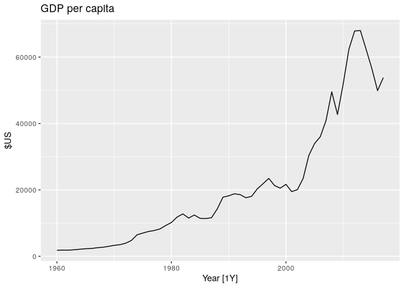
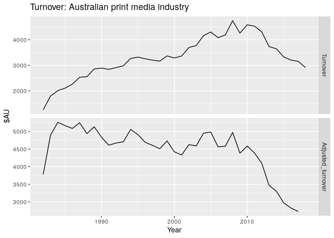
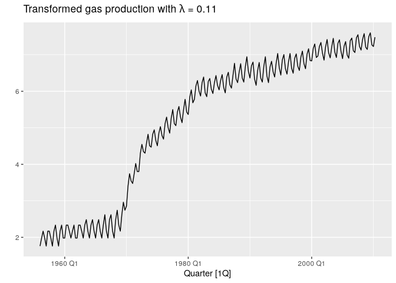

# 3.1 - TS Transformations and adjustments


``` r
library(fpp3)
```

Types:

- *Calendar adjustments*: eg. to accommodate different number of trading
  days, use average sales per day
- *Population adjustments*: use *per capita*
- *Inflation adjustments*: adjust based on CPI
  $x_{t} = y_{t}/z_{t} * z_{\text{base year}}$ for $z$ being the price
  index
- *Mathematical transformations*: eg, Box-Cox

## Population adjustment example

``` r
library(fpp3)
```

``` r
global_economy |>
  filter(Country == 'Australia') |>
  autoplot(GDP/Population) +
  labs(title = "GDP per capita", y="$US")
```



## Inflation adjustment example

``` r
print_retail <- aus_retail |>
  filter(Industry == "Newspaper and book retailing") |>
  group_by(Industry) |>
  index_by(Year = year(Month)) |>
  summarise(Turnover = sum(Turnover))
aus_economy <- global_economy |>
  filter(Code == "AUS")
```

``` r
print_retail |>
  left_join(aus_economy, by = "Year") |>
  mutate(Adjusted_turnover = Turnover / CPI * 100) |>
  pivot_longer(c(Turnover, Adjusted_turnover),
               values_to = "Turnover") |>
  mutate(name = factor(name,
                       levels = c("Turnover", "Adjusted_turnover"))) |>
  ggplot(aes(x = Year, y = Turnover)) +
  geom_line() +
  facet_grid(name ~ ., scales = "free_y") +
  labs(title = "Turnover: Australian print media industry",
       y = "$AU")
```

    Warning: Removed 1 row containing missing values or values outside the scale range
    (`geom_line()`).



Using the adjusted figures, the true industry decline is unmasked.

## Mathematical transformation Box-Cox

$$
\begin{equation}
  w_t  =
    \begin{cases}
      \log(y_t) & \text{if $\lambda=0$};  \\
      (\text{sign}(y_t)|y_t|^\lambda-1)/\lambda & \text{otherwise}.
    \end{cases}
    \tag{3.1}
\end{equation}
$$

This is actually a modified Box-Cox transformation, discussed in Bickel
& Doksum
([1981](https://otexts.com/fpp3/transformations.html#ref-Bickel1981)),
which allows for negative values of $y_t$ provided λ\>0.

The logarithm in a Box-Cox transformation is always a natural logarithm
(i.e., to base $e$). So if λ=0, natural logarithms are used, but if λ≠0,
a power transformation is used, followed by some simple scaling.

If λ=1, then wt=yt−1, so the transformed data is shifted downwards but
there is no change in the shape of the time series. For all other values
of λ, the time series will change shape.

``` r
lambda <- aus_production |>
  features(Gas, features = guerrero) |>
  pull(lambda_guerrero)
aus_production |>
  autoplot(box_cox(Gas, lambda)) +
  labs(y = "",
       title = latex2exp::TeX(paste0(
         "Transformed gas production with $\\lambda$ = ",
         round(lambda, 2)
       )))
```


