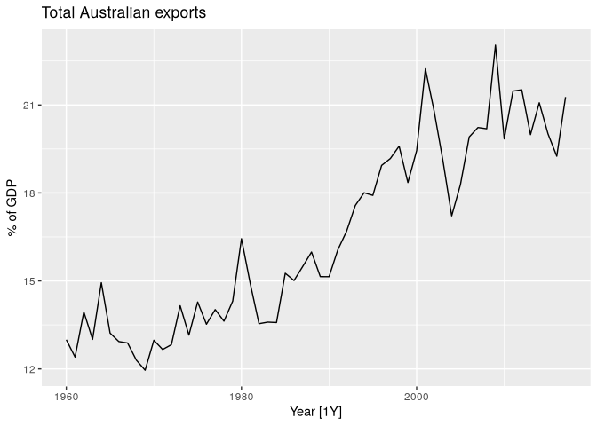
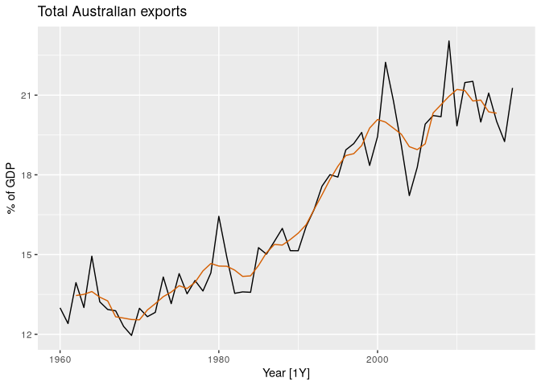
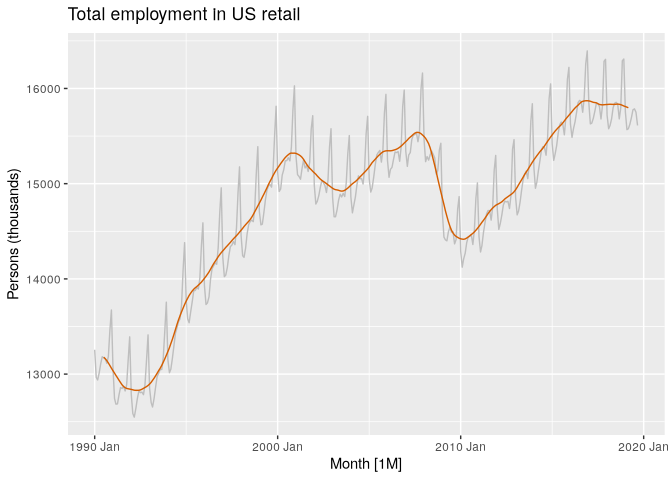

# 3.4 - Moving Averages


``` r
library(fpp3)
```

## MA Smoothing

$$
\begin{equation}
  \hat{T}_{t} = \frac{1}{m} \sum_{j=-k}^k y_{t+j}
\end{equation}
$$

where $m=2k+1$.

``` r
global_economy |>
  filter(Country == "Australia") |>
  autoplot(Exports) +
  labs(y="% of GDP", title = "Total Australian exports")
```



``` r
aus_exports <- global_economy |>
  filter(Country == "Australia") |>
  mutate(
    `5-MA` = slider::slide_dbl(Exports, mean,
                               .before = 2,
                               .after = 2,
                               .complete = TRUE)
  )
```

``` r
aus_exports |>
  autoplot(Exports) +
  geom_line(aes(y = `5-MA`), color = "#D55E00") +
  labs(y = "% of GDP",
       title = "Total Australian exports")
```

    Warning: Removed 4 rows containing missing values or values outside the scale range
    (`geom_line()`).



## Moving averages of moving averages

For even-order moving averages, eg. periods of 12 or 4. Apply an M2
period after the even selection.

``` r
beer <- aus_production |>
  filter(year(Quarter) >= 1992) |>
  select(Quarter, Beer)
beer_ma <- beer |>
  mutate(
    `4-MA` = slider::slide_dbl(Beer, mean,
                               .before = 1, .after = 2,
                               .complete = TRUE),
    `2x4-MA` = slider::slide_dbl(`4-MA`, mean,
                                 .before = 1, .after = 0,
                                 .complete = TRUE)
  )
```

``` r
beer_ma
```

    # A tsibble: 74 x 4 [1Q]
       Quarter  Beer `4-MA` `2x4-MA`
         <qtr> <dbl>  <dbl>    <dbl>
     1 1992 Q1   443    NA       NA 
     2 1992 Q2   410   451.      NA 
     3 1992 Q3   420   449.     450 
     4 1992 Q4   532   452.     450.
     5 1993 Q1   433   449      450.
     6 1993 Q2   421   444      446.
     7 1993 Q3   410   448      446 
     8 1993 Q4   512   438      443 
     9 1994 Q1   449   441.     440.
    10 1994 Q2   381   446      444.
    # ℹ 64 more rows

## Estimate trend-cycle with seasonal data

``` r
us_retail_employment <- us_employment |>
  filter(year(Month) >= 1990, Title == "Retail Trade") |>
  select(-Series_ID)
```

``` r
us_retail_employment_ma <- us_retail_employment |>
  mutate(
    `12-MA` = slider::slide_dbl(Employed, mean,
                                .before = 5, .after = 6,
                                .complete = TRUE),
    `2x12-MA` = slider::slide_dbl(`12-MA`, mean,
                                  .before = 1, .after = 0,
                                  .complete = TRUE)
  )
us_retail_employment_ma |>
  autoplot(Employed, colour = "gray") +
  geom_line(aes(y = `2x12-MA`), colour = "#D55E00") +
  labs(y = "Persons (thousands)",
       title = "Total employment in US retail")
```

    Warning: Removed 12 rows containing missing values or values outside the scale range
    (`geom_line()`).



### Weighted moving averages

Combinations of moving averages result in weighted moving averages. For
example, the $2×4$-MA discussed above is equivalent to a weighted 5-MA
with weights given by
$\left[\frac{1}{8},\frac{1}{4},\frac{1}{4},\frac{1}{4},\frac{1}{8}\right]$.
In general, a weighted m-MA can be written as
$$\hat{T}_t = \sum_{j=-k}^k a_j y_{t+j}$$, where k=(m−1)/2, and the
weights are given by $[a_{-k}, \dots, a_k$. It is important that the
weights all sum to one and that they are symmetric so that
$a_j = a_{-j}$. The simple m-MA is a special case where all of the
weights are equal to 1/m.

A major advantage of weighted moving averages is that they yield a
smoother estimate of the trend-cycle. Instead of observations entering
and leaving the calculation at full weight, their weights slowly
increase and then slowly decrease, resulting in a smoother curve.
