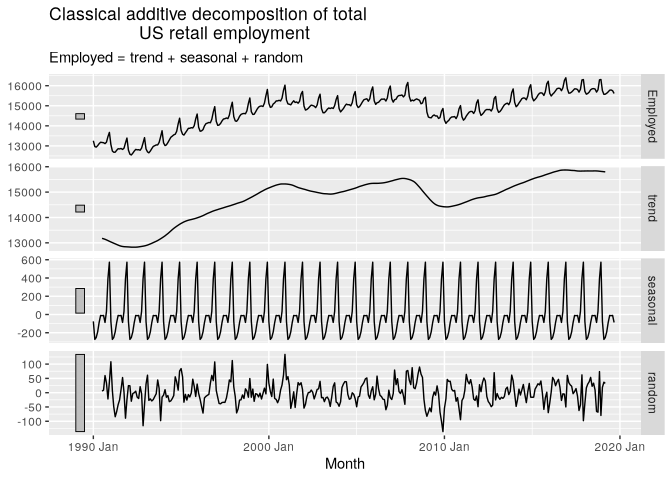

# 3.5 - Classical Time Series Decomposision


``` r
library(fpp3)
```

# 3.4 Classical Decomposition

``` r
us_retail_employment <- us_employment |>
  filter(year(Month) >= 1990, Title == "Retail Trade") |>
  select(-Series_ID)
```

While classical decomposition is still widely used, it is not
recommended, as there are now several much better methods. Some of the
problems with classical decomposition are summarised below.

- 

- The estimate of the trend-cycle is unavailable for the first few and
  last few observations. For example, if m=12, there is no trend-cycle
  estimate for the first six or the last six observations. Consequently,
  there is also no estimate of the remainder component for the same time
  periods.

- The trend-cycle estimate tends to over-smooth rapid rises and falls in
  the data.

- Classical decomposition methods assume that the seasonal component
  repeats from year to year. For many series, this is a reasonable
  assumption, but for some longer series it is not. For example,
  electricity demand patterns have changed over time as air conditioning
  has become more widespread. In many locations, the seasonal usage
  pattern from several decades ago had its maximum demand in winter (due
  to heating), while the current seasonal pattern has its maximum demand
  in summer (due to air conditioning). Classical decomposition methods
  are unable to capture these seasonal changes over time.

- Occasionally, the values of the time series in a small number of
  periods may be particularly unusual. For example, the monthly air
  passenger traffic may be affected by an industrial dispute, making the
  traffic during the dispute different from usual. The classical method
  is not robust to these kinds of unusual values.

``` r
us_retail_employment |>
  model(
    classical_decomposition(Employed, type = "additive")
  ) |>
  components() |>
  autoplot() +
  labs(title = "Classical additive decomposition of total
                  US retail employment")
```

    Warning: Removed 6 rows containing missing values or values outside the scale range
    (`geom_line()`).


