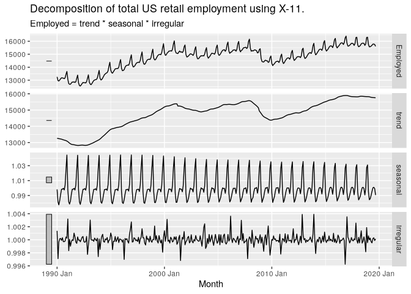
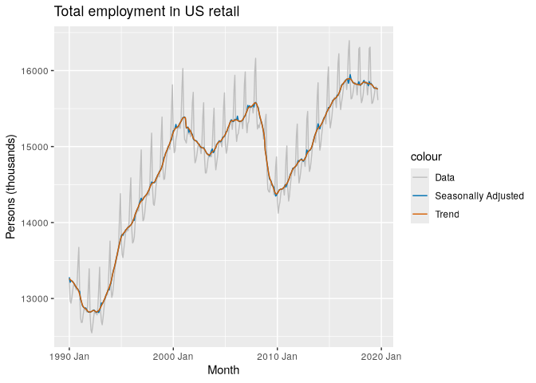
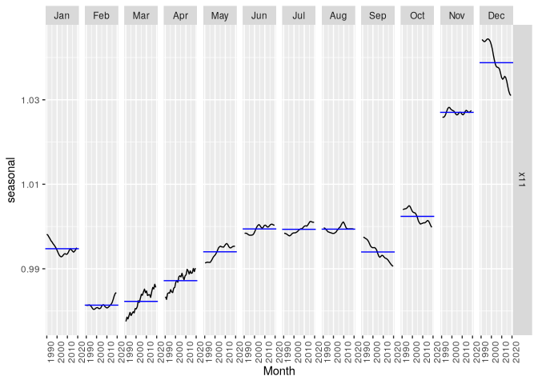
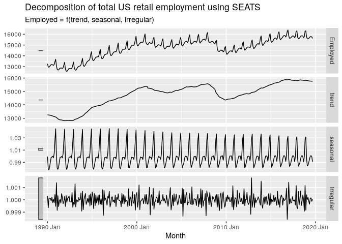

# 3.5 - Agency Methods


``` r
library(fpp3)
```

``` r
us_retail_employment <- us_employment |>
  filter(year(Month) >= 1990, Title == "Retail Trade") |>
  select(-Series_ID)
```

## X-11

Classical but includes additional steps. Allows for holidays, known
predictors, seasonal component can vary over time.

``` r
x11_dcmp <- us_retail_employment |>
  model(x11 = X_13ARIMA_SEATS(Employed ~ x11())) |>
  components()
autoplot(x11_dcmp) +
  labs(title =
    "Decomposition of total US retail employment using X-11.")
```



``` r
x11_dcmp |>
  ggplot(aes(x = Month)) +
  geom_line(aes(y = Employed, colour = "Data")) +
  geom_line(aes(y = season_adjust,
                colour = "Seasonally Adjusted")) +
  geom_line(aes(y = trend, colour = "Trend")) +
  labs(y = "Persons (thousands)",
       title = "Total employment in US retail") +
  scale_colour_manual(
    values = c("gray", "#0072B2", "#D55E00"),
    breaks = c("Data", "Seasonally Adjusted", "Trend")
  )
```



``` r
x11_dcmp |>
  gg_subseries(seasonal)
```



## SEATS

``` r
seats_dcmp <- us_retail_employment |>
  model(seats = X_13ARIMA_SEATS(Employed ~ seats())) |>
  components()
autoplot(seats_dcmp) +
  labs(title =
    "Decomposition of total US retail employment using SEATS")
```


