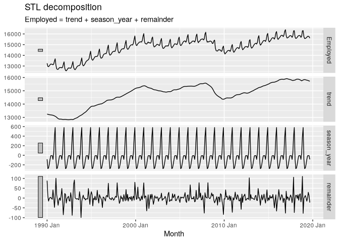

# 3.6 - STL Decomposition


``` r
library(fpp3)
```

    Registered S3 method overwritten by 'tsibble':
      method               from 
      as_tibble.grouped_df dplyr

    ── Attaching packages ──────────────────────────────────────────── fpp3 1.0.1 ──

    ✔ tibble      3.2.1     ✔ tsibble     1.1.6
    ✔ dplyr       1.1.4     ✔ tsibbledata 0.4.1
    ✔ tidyr       1.3.1     ✔ feasts      0.4.1
    ✔ lubridate   1.9.4     ✔ fable       0.4.1
    ✔ ggplot2     3.5.1     

    ── Conflicts ───────────────────────────────────────────────── fpp3_conflicts ──
    ✖ lubridate::date()    masks base::date()
    ✖ dplyr::filter()      masks stats::filter()
    ✖ tsibble::intersect() masks base::intersect()
    ✖ tsibble::interval()  masks lubridate::interval()
    ✖ dplyr::lag()         masks stats::lag()
    ✖ tsibble::setdiff()   masks base::setdiff()
    ✖ tsibble::union()     masks base::union()

# 3.6 STL decomposition

STL has several advantages over classical decomposition, and the SEATS
and X-11 methods:

- Unlike SEATS and X-11, STL will handle any type of seasonality, not
  only monthly and quarterly data.
- The seasonal component is allowed to change over time, and the rate of
  change can be controlled by the user.
- The smoothness of the trend-cycle can also be controlled by the user.
- It can be robust to outliers (i.e., the user can specify a robust
  decomposition), so that occasional unusual observations will not
  affect the estimates of the trend-cycle and seasonal components. They
  will, however, affect the remainder component.

On the other hand, STL has some disadvantages. In particular, it does
not handle trading day or calendar variation automatically, and it only
provides facilities for additive decompositions.

``` r
us_retail_employment <- us_employment |>
  filter(year(Month) >= 1990, Title == "Retail Trade") |>
  select(-Series_ID)
```

``` r
us_retail_employment |>
  model(
    STL(Employed ~ trend(window = 7) +
                   season(window = "periodic"),
    robust = TRUE)) |>
  components() |>
  autoplot()
```


